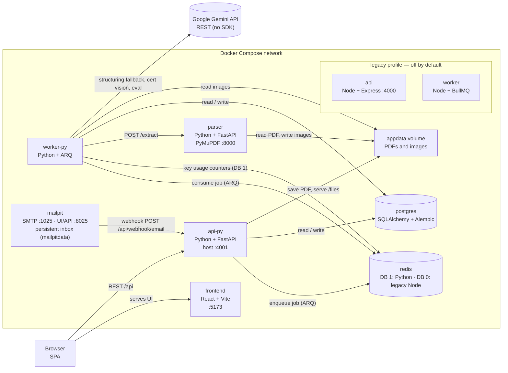
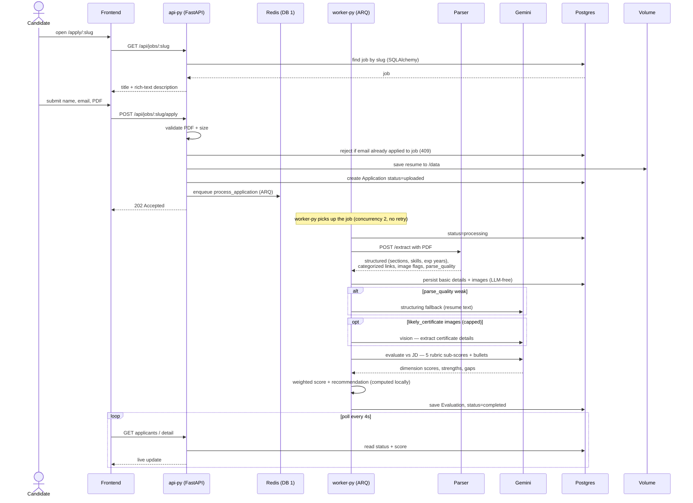
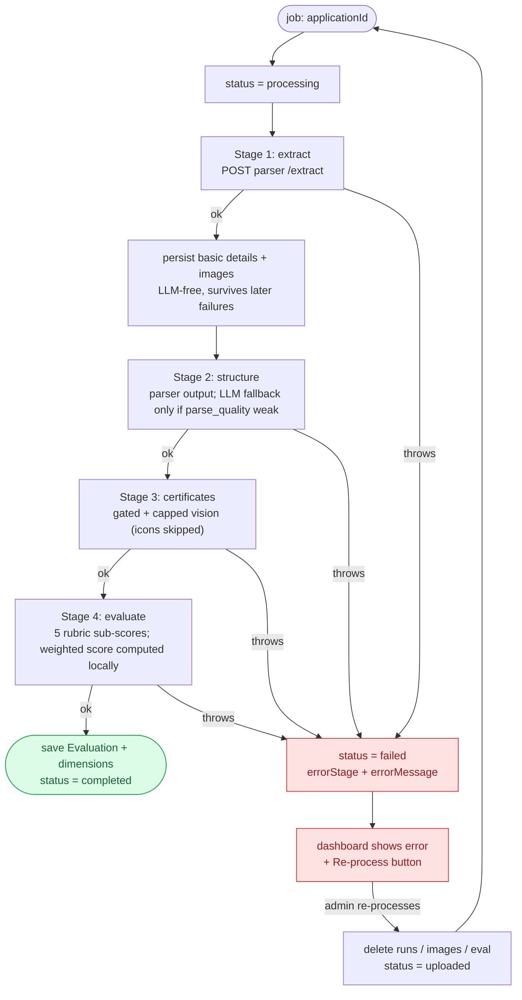
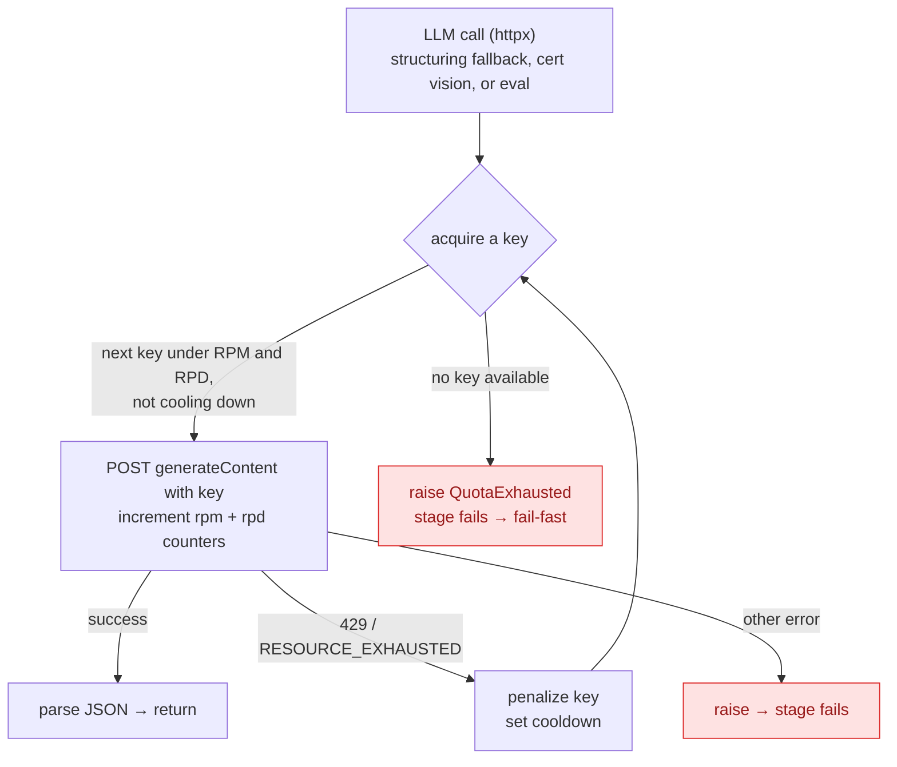
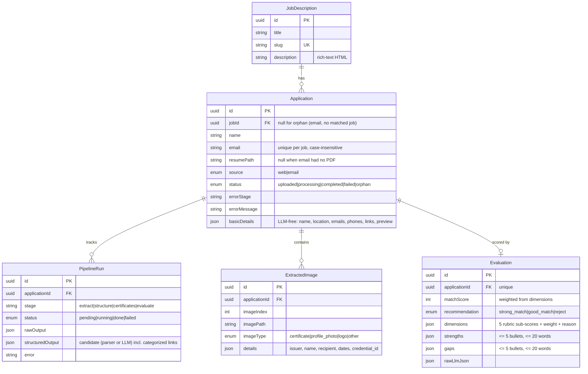

# ATS Resume Scorer — Architecture

Five views of the system. All diagrams are [Mermaid](https://mermaid.js.org/) — they render
on GitHub and in most Markdown previewers.

The backend was **migrated from Node (Express · Sequelize · BullMQ) to Python
(FastAPI · SQLAlchemy 2.0 · Alembic · ARQ)**. The Python stack (`api-py` / `worker-py`) is
the default; the original Node stack (`api` / `worker`) is retained behind a Docker Compose
`legacy` profile and is not started by default. Both talk to the **same** Postgres, Redis,
parser, and `appdata` volume, so the migration changed the application layer, not the data.

The pipeline is **deterministic-first**: PyMuPDF + Python do the structuring, link
categorization, and certificate detection, so AI is used only where it earns its keep —
**one** evaluation call for a clean resume (a structuring fallback and gated certificate
vision fire only when needed), down from the old 3 + N calls.

> **Tech stack at a glance.** Web: FastAPI (Uvicorn). ORM: SQLAlchemy 2.0 async (asyncpg).
> Migrations: Alembic. Queue: ARQ (Redis). LLM: Google Gemini over **raw HTTP (httpx, no SDK)**.
> Validation: Pydantic. Inbound email: Mailpit.

---

## 1. Container topology

The active Docker Compose services, the shared volume, and the one external dependency (Gemini).
Postgres and Redis are **internal only**; the browser reaches just the frontend and the API.
The legacy Node `api`/`worker` (dashed) only run with `docker compose --profile legacy up`.



---

## 2. Apply → score (end-to-end sequence)

What happens from a candidate hitting submit to the score appearing on the dashboard.



> `VOL` is the shared `/data` (`appdata`) volume that api-py, worker-py, and the parser mount.

### 2b. Email ingestion (alternate entry point)

A candidate can also apply by emailing a PDF with the **job's UUID in the body**. Mailpit
catches the message and fires a webhook at `api-py`; ingestion mirrors the web flow.

```mermaid
sequenceDiagram
  actor C as Candidate
  participant MP as Mailpit
  participant API as api-py
  participant DB as Postgres
  participant RD as Redis (DB 1)

  C->>MP: email PDF (job UUID in body) → SMTP :1025
  MP->>API: POST /api/webhook/email (Basic auth, message ID)
  API->>API: verify shared secret (constant-time); always ack 200
  API->>MP: GET full message + download PDF attachment
  API->>DB: resolve job by UUID; dedupe by (job, email)
  Note over API,DB: job + PDF → uploaded (enqueue) · job + no PDF → failed ·<br/>no job → orphan (awaits manual assignment)
  API->>RD: enqueue (only when status=uploaded)
```

---

## 3. Pipeline orchestration (fail-fast)

`worker-py` drives four stages. Each is recorded as a `PipelineRun` (running → done/failed).
**Any** stage that throws aborts the whole job, records *which* stage broke, and stops — no
partial scoring. Recovery is an explicit admin **Re-process**.



**Deterministic-first:** the parser categorizes links by domain and flags certificate-like
images, so the link-structuring and per-image vision calls of the old design are gone. The LLM
runs only for the final evaluation, plus a structuring fallback (weak parses) and gated
certificate vision. The orchestrator is pure control flow with injected collaborators
(`repo`, `extract`, `call`, `load_image`), unchanged in behavior from the Node version.

---

## 4. Gemini key pool (rotation + 429 failover)

Every LLM call goes through the pool so a handful of free-tier keys behave like one larger quota.
The pool is pure Python; calls hit the Gemini REST API directly via `httpx` (no SDK). Usage is
tracked in **Redis DB 1**: `gkey:rpm:<key>` (TTL 60s), `gkey:rpd:<key>` (TTL 24h), and
`gcool:<key>` (cooldown).



> **Side-by-side caveat.** The Python stack tracks quota on Redis DB 1; the legacy Node stack
> tracks it on DB 0. If you ever run both at once (`--profile legacy`), their per-key budgets are
> counted separately and could collectively exceed the real quota — route live traffic to one
> stack at a time.

---

## 5. Data model

SQLAlchemy models map onto the **existing** schema created by the original Sequelize migrations
(camelCase columns, named Postgres enums). Alembic tracks schema versions in its own
`alembic_version` table, separate from Node's `SequelizeMeta`.



---

## Migrations & schema

Schema changes go through **Alembic** (`backend-py/alembic/`), the SQLAlchemy migration tool —
the replacement for the old `sequelize-cli` migrations.

- **On startup**, `api-py` runs `alembic upgrade head` before serving (see its compose `command`),
  mirroring how the Node `api` ran `sequelize-cli db:migrate`. `worker-py` does not run migrations.
- The existing schema was adopted via `alembic stamp head` against an empty baseline revision
  (no tables recreated). Alembic is told to ignore Node's `SequelizeMeta` table and the
  `(jobId, lower(email))` functional index.
- **Create a migration:** edit a model in `app/db/models.py`, then
  `alembic revision --autogenerate -m "…"`, review the generated file, and
  `alembic upgrade head` (or just restart `api-py`).
- **Gotchas:** review autogenerated files; Postgres enum value additions need manual
  `op.execute("ALTER TYPE … ADD VALUE …")`.

---

## Pipeline cheat-sheet

What the parser derives deterministically (no AI), and where AI still runs.

| Concern | Owner | How | AI? |
|---------|-------|-----|-----|
| Resume text | parser | PyMuPDF `get_text` (+ `get_text("dict")` for fonts) | No |
| Sections / skills / experience-years / education | parser | font-size/bold header detection + regex + skill alias map | No |
| Links (text + icon-embedded), categorized | parser | bbox overlap for icon links; domain map → `linkedin/github/…/other` | No |
| Image triage | parser | `is_icon` / `likely_certificate` flags from size + link match | No |
| Structuring fallback | worker-py | only when `parse_quality` is weak (messy/unusual layouts) | Gemini text |
| Certificate details | worker-py | gated + capped vision on `likely_certificate` images | Gemini vision |
| Evaluation | worker-py | JD + compact candidate → 5 rubric sub-scores; **weighted score computed locally** | Gemini text |

**Rubric weights:** Hard Skills 35% · Experience Relevance 30% · Seniority/Scope 15% ·
Education/Certifications 10% · Domain Knowledge 10% (fixed in config). The Gemini model is set
via `GEMINI_MODEL`.

---

## Running it

- **Default (Python) stack:** `docker compose up -d` → db, redis, parser, **api-py (:4001)**,
  **worker-py**, mailpit, frontend. The frontend (`:5173`) talks to `:4001`.
- **Legacy (Node) stack:** `docker compose --profile legacy up -d` brings back `api` (:4000) and
  `worker`. To route traffic to it, set `VITE_API_BASE=http://localhost:4000` and the Mailpit
  `MP_WEBHOOK_URL` back to `@api:4000`.
