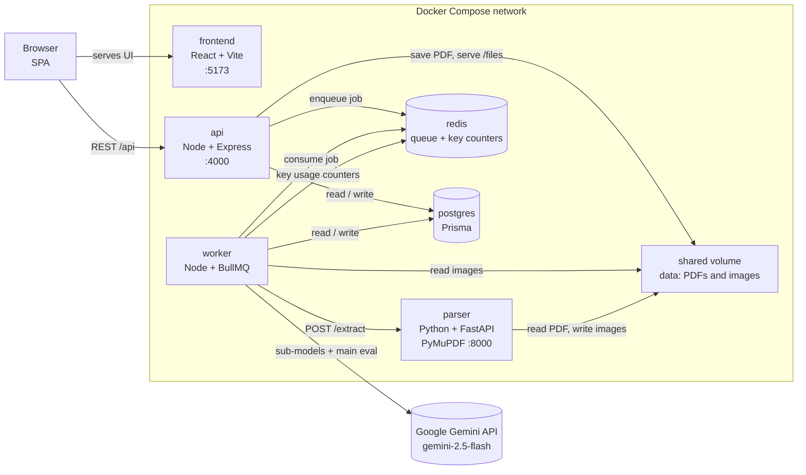
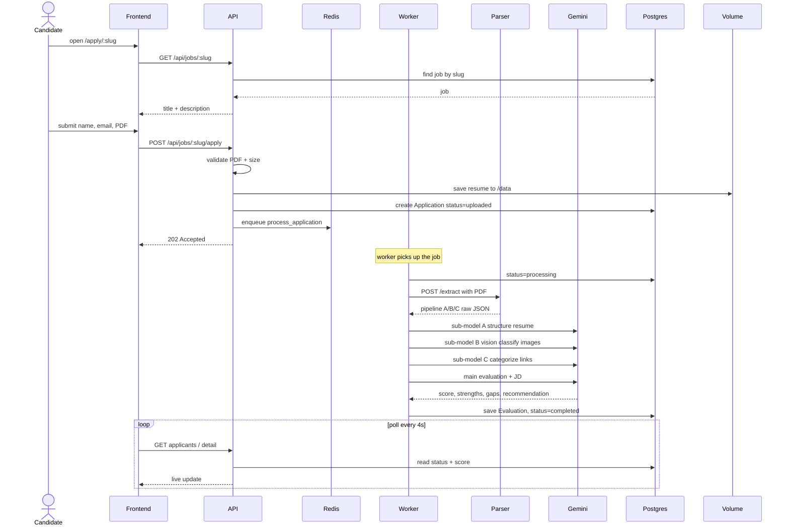
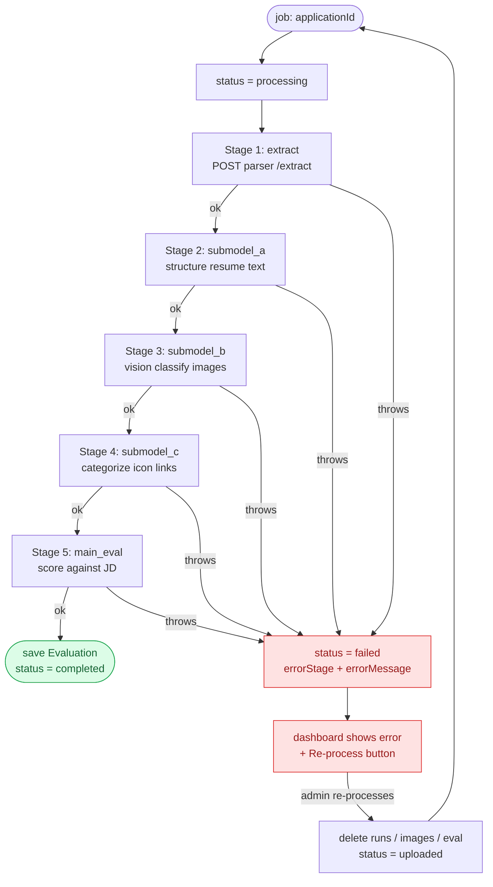
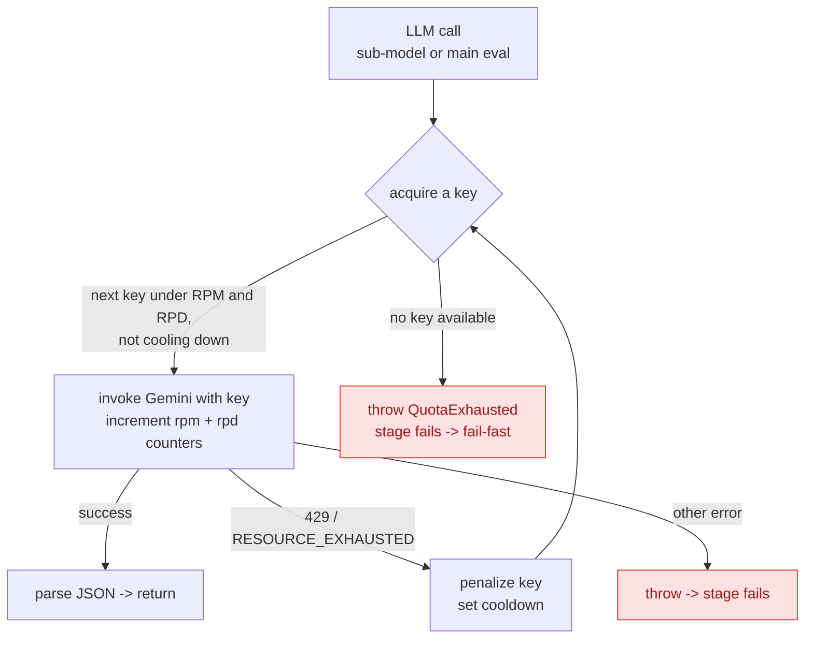
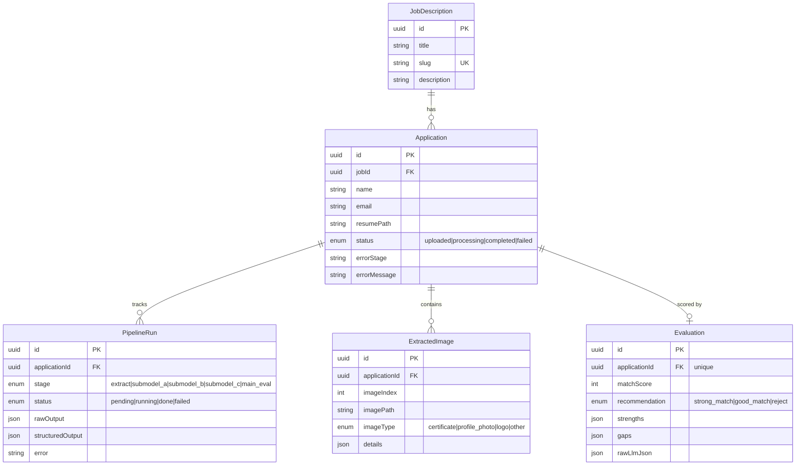

# ATS Resume Scorer — Architecture

Five views of the system. All diagrams are [Mermaid](https://mermaid.js.org/) — they render
on GitHub and in most Markdown previewers.

---

## 1. Container topology

The six Docker Compose services, the shared volume, and the one external dependency (Gemini).
Postgres and Redis are **internal only**; the browser reaches just the frontend and the API.

---

## 2. Apply → score (end-to-end sequence)

What happens from a candidate hitting submit to the score appearing on the dashboard.

> `VOL` above is the shared `/data` volume that the API and worker both mount.

---

## 3. Pipeline orchestration (fail-fast)

The worker drives five stages. Each is recorded as a `PipelineRun` (running → done/failed).
**Any** stage that throws aborts the whole job, records *which* stage broke, and stops — no
partial scoring. Recovery is an explicit admin **Re-process**.

**Step 1 of the AI layer** = the three sub-models (A/B/C) turning raw pipeline output into
structured JSON. **Step 2** = the main model combining all three + the JD into the final score.

---

## 4. Gemini key pool (rotation + 429 failover)

Every LLM call goes through the pool so a handful of free-tier keys behave like one larger quota.
Usage is tracked in Redis: `rpm:<key>` (TTL 60s), `rpd:<key>` (TTL 24h), `gcool:<key>` (cooldown).

---

## 5. Data model

---

## Pipeline cheat-sheet

| Pipeline | Owner | Extracts | Library / model |
|----------|-------|----------|-----------------|
| **A** Text + explicit links | parser | Resume text + clickable text URLs | PyMuPDF `get_text` / `get_links` |
| **B** Images + OCR/vision | parser → worker | Embedded images; then certificate vs photo + details | PyMuPDF `extract_image` → Gemini vision |
| **C** Icon-embedded links | parser | Hyperlinks whose rect overlaps an image (e.g. LinkedIn icon) | PyMuPDF link rects + bbox overlap |
