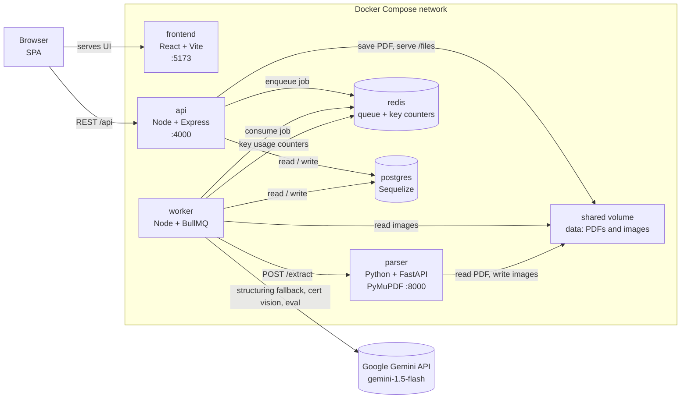
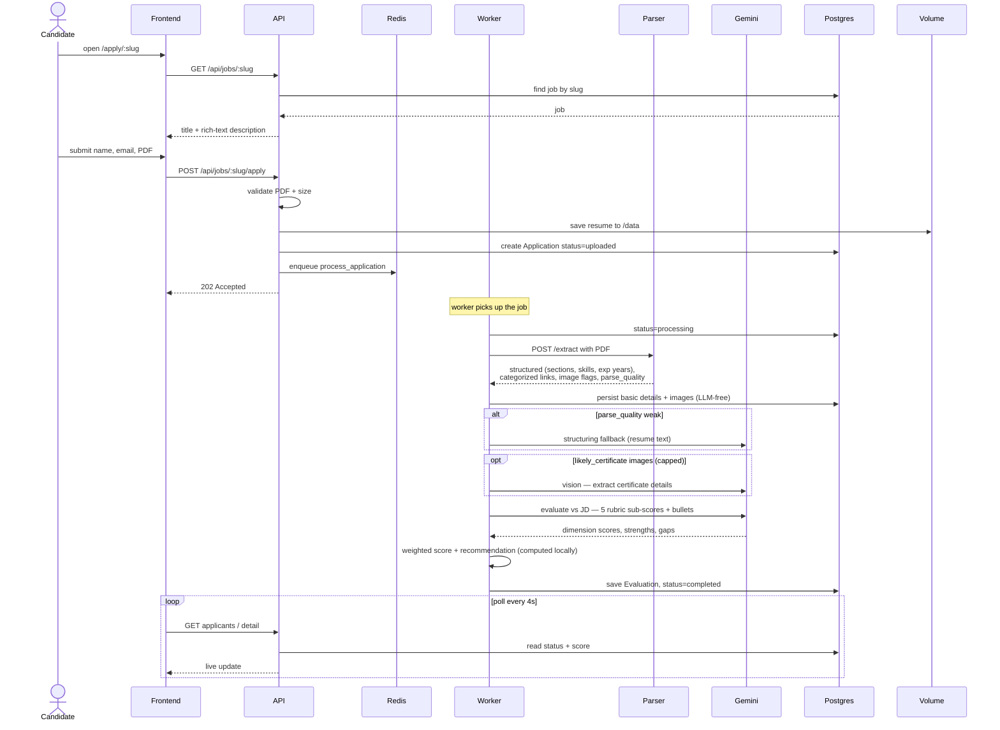
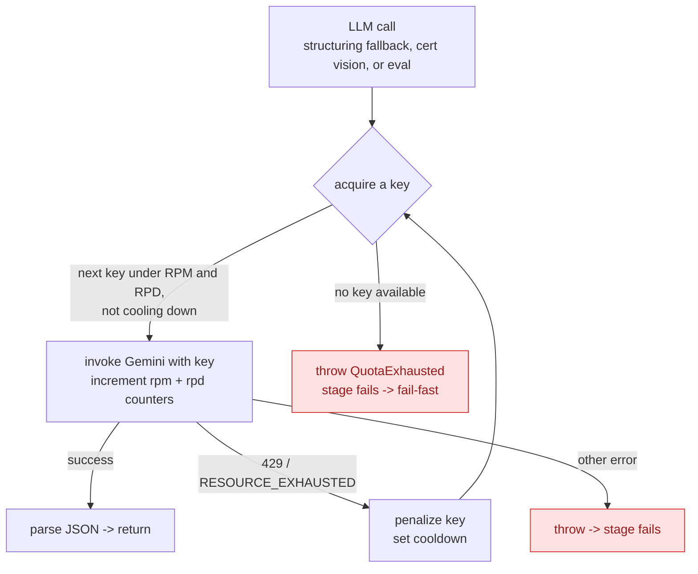
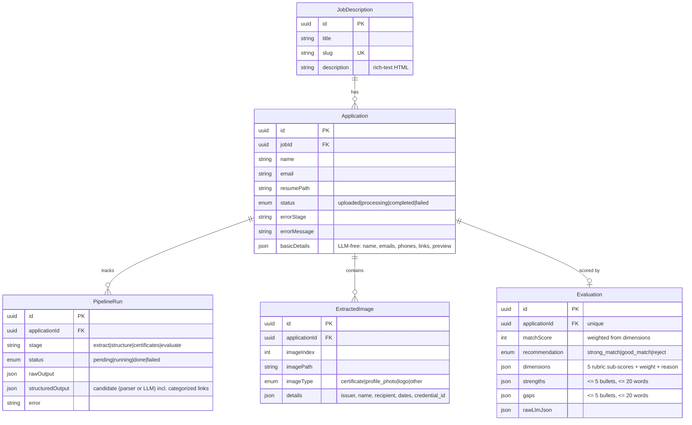

# ATS Resume Scorer — Architecture

Five views of the system. All diagrams are [Mermaid](https://mermaid.js.org/) — they render
on GitHub and in most Markdown previewers.

The pipeline is **deterministic-first**: PyMuPDF + Python do the structuring, link
categorization, and certificate detection, so AI is used only where it earns its keep —
**one** evaluation call for a clean resume (a structuring fallback and gated certificate
vision fire only when needed), down from the old 3 + N calls.

---

## 1. Container topology

The six Docker Compose services, the shared volume, and the one external dependency (Gemini).
Postgres and Redis are **internal only**; the browser reaches just the frontend and the API.

---

## 2. Apply → score (end-to-end sequence)

What happens from a candidate hitting submit to the score appearing on the dashboard.

> `VOL` above is the shared `/data` volume that the API and worker both mount.

---

## 3. Pipeline orchestration (fail-fast)

The worker drives four stages. Each is recorded as a `PipelineRun` (running → done/failed).
**Any** stage that throws aborts the whole job, records *which* stage broke, and stops — no
partial scoring. Recovery is an explicit admin **Re-process**.

**Deterministic-first:** the parser categorizes links by domain and flags certificate-like
images, so the link-structuring and per-image vision calls of the old design are gone. The LLM
runs only for the final evaluation, plus a structuring fallback (weak parses) and gated
certificate vision.

---

## 4. Gemini key pool (rotation + 429 failover)

Every LLM call goes through the pool so a handful of free-tier keys behave like one larger quota.
Usage is tracked in Redis: `rpm:<key>` (TTL 60s), `rpd:<key>` (TTL 24h), `gcool:<key>` (cooldown).

---

## 5. Data model

---

## Pipeline cheat-sheet

What the parser now derives deterministically (no AI), and where AI still runs.

| Concern | Owner | How | AI? |
|---------|-------|-----|-----|
| Resume text | parser | PyMuPDF `get_text` (+ `get_text("dict")` for fonts) | No |
| Sections / skills / experience-years / education | parser | font-size/bold header detection + regex + skill alias map | No |
| Links (text + icon-embedded), categorized | parser | bbox overlap for icon links; domain map → `linkedin/github/…/other` | No |
| Image triage | parser | `is_icon` / `likely_certificate` flags from size + link match | No |
| Structuring fallback | worker | only when `parse_quality` is weak (messy/unusual layouts) | Gemini text |
| Certificate details | worker | gated + capped vision on `likely_certificate` images | Gemini vision |
| Evaluation | worker | JD + compact candidate → 5 rubric sub-scores; **weighted score computed locally** | Gemini text |

**Rubric weights:** Hard Skills 35% · Experience Relevance 30% · Seniority/Scope 15% ·
Education/Certifications 10% · Domain Knowledge 10% (fixed in config).
